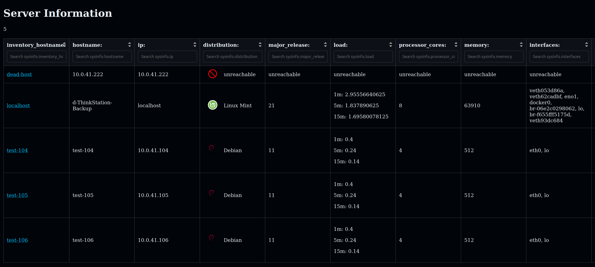

# ansible_cmdb

Ansible Module to create a CMDB Table view of all your hosts in inventory

 - can be used with every webserver
 - really simple js, html and css
 - infos stored in json and html files

## Overview



 - Sortable list
 - search via regex
 - full customizable
 - show of unreachable servers

## Detailview


Detail page for every server with all grabbed informations.

## Usage

Role can be simply included from ansible playbook

```yaml
---
- name: CMDB
  hosts: all
  gather_facts: true
  ignore_unreachable: true
  roles:
    - ansible_cmdb
```

and configured in inventory, for example:

```yaml
ansible_cmdb_webserver_hostname: localhost  # used to delegate the tasks
ansible_cmdb_webserver_path: /var/www/pub/cmdb

ansible_cmdb_webserver_owner: www-data
ansible_cmdb_webserver_group: www-data
ansible_cmdb_webserver_mode_files: '0644'
ansible_cmdb_webserver_mode_folder: '0755'
```

Reports can be enabled or disabled

```yaml
# reports
ansible_cmdb_report_hallo_welt: true
ansible_cmdb_report_hostvars: true
ansible_cmdb_report_maxauthtries: true
ansible_cmdb_report_sysinfo: true
ansible_cmdb_report_tmout: true
ansible_cmdb_report_uname: true
```

HTML Overview columns can be rearranged, columns can be activated or deactivated

```yaml
ansible_cmdb_columns:
  - sysinfo.inventory_hostname
  - sysinfo.hostname
  - sysinfo.ip
  - sysinfo.distribution
  - sysinfo.major_release
  - sysinfo.load
  # - sysinfo.os_family
  - sysinfo.processor_cores
  - sysinfo.memory
  - sysinfo.interfaces
  - tmout.tmout
```

Colors can be set via variable

```yaml
ansible_cmdb_css_background_color: "#010409"
ansible_cmdb_css_font_color: "#e6edf3"
```

All settings can be found in [defaults/main.yaml](defaults/main.yaml)

## Custom Plugins

Create your own ideas and store your custom plugins in tasks/reports/custom_reports

# Contribute

Help us! Send issues and contribute your ideas.
