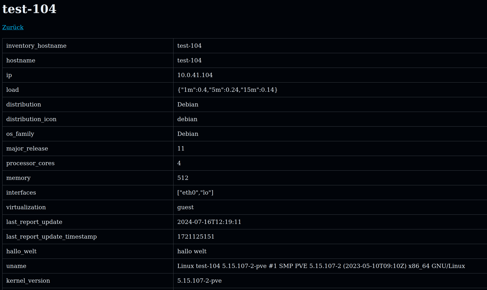

# ansible_cmdb

Ansible Module to create a CMDB Table view of all your hosts in inventory

## Overview

 - Sortable list
 - search via regex
 - full customizable
 - show of unreachable servers

## Detailview

Detail page for every server with all grabbed informations.
